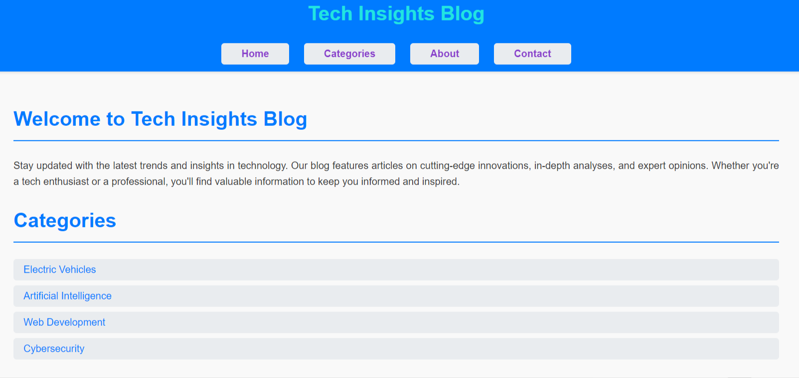
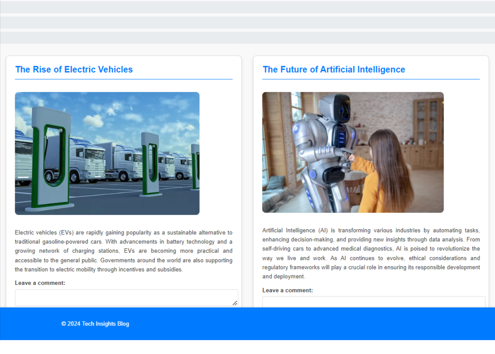

# Blog Website

## Project Overview
This repository contains a web development project titled "Blog Website," developed as part of the Web Development Internship at CodeClause. The project aims to construct a blog platform featuring multiple articles, each with images, categorized content, and a comment section.

## Project Details
- **Aim**: Construct a blog platform with multiple articles.
- **Description**: Design and develop a blog website where users can read articles, view associated images, explore different categories, and interact through a comment section.
- **Technologies Used**: HTML, CSS, JavaScript

## Demo

## Key Features
1. **Article Management**: Display multiple articles dynamically.
2. **Image Integration**: Include images for each article to enhance visual appeal.
3. **Category Navigation**: Organize articles into categories for easy navigation.
4. **Comment Section**: Allow users to interact by commenting on articles.
5. **Responsive Design**: Ensure the website adapts well to different screen sizes and devices.

## Project Structure
- **index.html**: Main HTML file containing the structure of the blog.
- **styles.css**: CSS file for styling the blog website.
- **script.js**: JavaScript file for dynamic content creation and event handling.

## How to Run
1. Clone the repository:
git clone https://github.com/dveersingh000/CodeClauseInternship_Blog_Project.git

2. Open `index.html` in a web browser to view the blog website.

## Further Enhancements
- Implement user authentication for commenting.
- Add a search functionality to find articles by keywords.
- Integrate a backend server for storing and managing articles and comments.

## Credits
Developed by Dharamveer Singh as part of the Web Development Internship at CodeClause.
